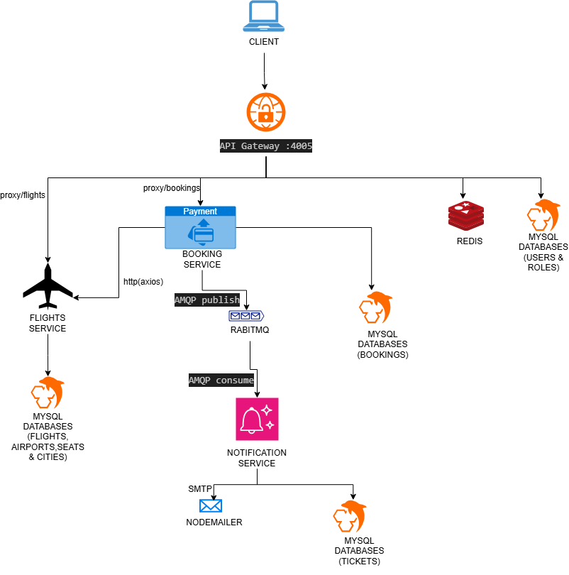

# ✈️ AeroMind — Distributed Flight Booking System

AeroMind is a production-grade, microservices-based flight reservation platform. It was engineered specifically to tackle common distributed system challenges such as high concurrency, network failures, and decoupled async processing.

> **⚠️ Multi-Repository Architecture**
> AeroMind is not a monolith. It is split into distinct microservices, each housed in its own repository:
>
> - [🔀 API Gateway - https://github.com/IamAbhinav01/AeroMind_API_GATEWAY_Service.git](https://github.com/IamAbhinav01/AeroMind_API_GATEWAY_Service.git)
> - [✈️ Flights Service - https://github.com/IamAbhinav01/AeroMind_Flight_Service.git](https://github.com/IamAbhinav01/AeroMind_Flight_Service.git)
> - [🎟️ Booking Service - https://github.com/IamAbhinav01/AeroMind_Booking_Service.git](https://github.com/IamAbhinav01/AeroMind_Booking_Service.git)
> - [📧 Notification Service - https://github.com/IamAbhinav01/AeroMind_Notification_Service.git](https://github.com/IamAbhinav01/AeroMind_Notification_Service.git)
> - [💻 Frontend UI - https://github.com/IamAbhinav01/AeroMind_FrontEnd_Service.git](https://github.com/IamAbhinav01/AeroMind_FrontEnd_Service.git)

---

## 🏗 High-Level Architecture

****

**Overview:**
The system uses an **API Gateway** pattern. Clients communicate exclusively with the Gateway, which handles authentication (JWT) and Rate Limiting. Valid requests are reverse-proxied to the **Flights Service** (for search/filtering) or the
**Booking Service** (for reservations/payments). Post-booking, asynchronous events are published to **RabbitMQ**, where the
**Notification Service** picks them up to send emails.

---

## 🛠 Core Engineering Challenges Solved

This project was built to solve specific, real-world problems found in distributed platforms.

### 1. Concurrency & Race Conditions (Overbooking)

**The Problem:** In a high-traffic scenario, two users might try to book the last available seat on a flight at the exact same millisecond. If both transactions read the seat count before either updates it, the system will overbook the flight.
**The Solution:** Implemented **Pessimistic Locking** at the database level.

- During the booking transaction, the Flights Service executes a `SELECT ... FOR UPDATE` query (using Sequelize's `lock: transaction.LOCK.UPDATE`).
- This locks the specific flight row. If a second request arrives, it is forced to wait until the first transaction commits or rolls back, guaranteeing 100% data integrity for seat inventory.

### 2. Network Reliability & Client-Side Idempotency

**The Problem:** If a user's network drops exactly as they click "Pay", they might click it again, resulting in the backend processing two identical payments and double-charging the user.
**The Solution:** Implemented **Idempotent Payment Processing**.

- The frontend generates a unique `x-idempotency-key` when a payment is initiated and stores it in `localStorage`.
- If the request times out and the user retries, the _exact same key_ is sent.
- The backend recognizes the key, preventing duplicate transactions and safely returning the cached success response.

### 3. Rate Limiting & API Abuse

**The Problem:** Public-facing endpoints, especially authentication, are vulnerable to brute-force attacks and DDOS.
**The Solution:** Built a custom **Token Bucket Rate Limiter** backed by Redis. Integrated at the API Gateway level, it efficiently restricts the number of requests a single IP can make within a given timeframe, returning `429 Too Many Requests` when limits are exceeded.

### 4. Decoupling via Event-Driven Architecture

**The Problem:** Sending confirmation emails synchronously during the booking flow slows down the user experience and ties the Booking Service's success to the Email provider's uptime.
**The Solution:** Integrated **RabbitMQ**. The Booking Service instantly returns a success response to the user while quietly publishing a `booking_confirmed` event to a message queue. The isolated Notification Service consumes this queue at its own pace to dispatch emails, ensuring zero UI blocking.

### 5. Centralized Reverse Proxy & Auth

**The Problem:** Handling CORS, JWT validation, and routing independently in every microservice creates massive code duplication and security risks.
**The Solution:** The API Gateway acts as a reverse proxy (via `http-proxy-middleware`). It authenticates incoming JWTs centrally. If valid, it attaches user context and proxies the request to the hidden downstream services on different ports.

---

## 💻 Tech Stack Highlights

- **Backend Runtime:** Node.js, Express.js
- **Databases:** MySQL (Data), Redis (Caching/Rate Limiting)
- **ORM:** Sequelize
- **Message Broker:** RabbitMQ (`amqplib`)
- **Frontend:** Vanilla JavaScript, CSS3 (No framework, pure DOM manipulation)

---

## 🚦 Local Setup Instructions

1. **Start Infrastructure:** Ensure MySQL, Redis, and RabbitMQ are running locally.
2. **Setup Databases:** Create `AeroMind_Gateway`, `AeroMind_Flights`, and `AeroMind_Bookings` in MySQL.
3. **Environment Variables:** Create a `.env` file in each service (Port mapping: Gateway=4005, Flights=3000, Bookings=3002, Notifications=3004).
4. **Migrate & Seed:** Run `npx sequelize db:migrate` in the Gateway, Flights, and Bookings services. Use the provided SQL seed file in the Flights service to populate demo flights.
5. **Run Services:** Execute `npm run dev` in all 4 service directories.
6. **Access App:** Navigate to `http://localhost:4005` to view the frontend served through the Gateway.
